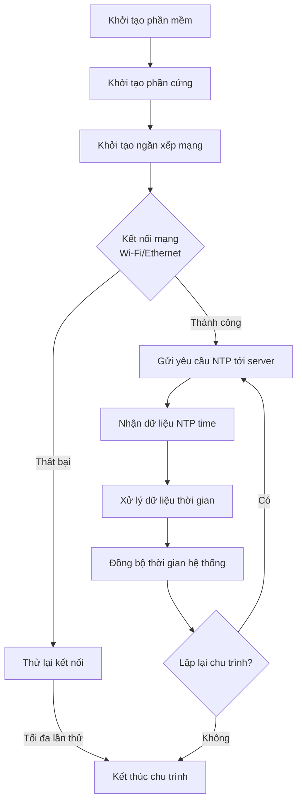

Để vẽ sơ đồ khối cho phần mềm nhúng với chức năng NTP (Network Time Protocol), Mermaid là một công cụ tốt vì nó đơn giản, dễ sử dụng, và cho phép mô tả sơ đồ bằng cú pháp văn bản. Mermaid hỗ trợ vẽ sơ đồ luồng (flowchart), sơ đồ tuần tự (sequence diagram), và nhiều loại sơ đồ khác, rất phù hợp để mô tả luồng xử lý của phần mềm nhúng.

Dưới đây, tôi sẽ sử dụng cú pháp Mermaid để vẽ một **sơ đồ luồng (flowchart)** mô tả quy trình phần mềm nhúng thực hiện chức năng NTP, từ khởi tạo phần mềm đến nhận dữ liệu NTP time từ client và kết thúc chu trình.

### Sơ đồ luồng chức năng NTP
Quy trình cơ bản của phần mềm nhúng với chức năng NTP bao gồm các bước:
1. Khởi tạo hệ thống (init hardware, network stack).
2. Thiết lập kết nối mạng (Wi-Fi/Ethernet).
3. Kết nối tới NTP server.
4. Gửi yêu cầu NTP time.
5. Nhận và xử lý dữ liệu thời gian.
6. Đồng bộ thời gian hệ thống.
7. Kết thúc hoặc lặp lại chu trình (tùy thiết kế).

Dưới đây là mã Mermaid để vẽ sơ đồ luồng:

### Giải thích sơ đồ
- **Khởi tạo phần mềm**: Bắt đầu bằng việc khởi tạo hệ thống, bao gồm phần cứng (ví dụ: RTC, bộ nhớ) và ngăn xếp mạng (TCP/IP).
- **Kết nối mạng**: Thiết lập kết nối Wi-Fi hoặc Ethernet. Nếu thất bại, hệ thống thử lại một số lần trước khi dừng.
- **Gửi yêu cầu NTP**: Gửi gói tin yêu cầu thời gian tới server NTP (ví dụ: pool.ntp.org).
- **Nhận và xử lý dữ liệu**: Nhận phản hồi từ server, phân tích gói tin NTP để lấy thời gian chính xác.
- **Đồng bộ thời gian**: Cập nhật thời gian hệ thống (RTC hoặc bộ đếm nội bộ).
- **Lặp lại chu trình**: Tùy thuộc vào thiết kế, hệ thống có thể lặp lại để đồng bộ định kỳ hoặc dừng.

### Mermaid có tốt để vẽ sơ đồ khối phần mềm nhúng không?
- **Ưu điểm**:
  - Dễ sử dụng, cú pháp đơn giản, không cần công cụ đồ họa phức tạp.
  - Hỗ trợ nhiều loại sơ đồ (flowchart, sequence diagram, Gantt, v.v.).
  - Tích hợp tốt với các nền tảng như Markdown, GitHub, hoặc các IDE hỗ trợ Mermaid.
  - Phù hợp để mô tả luồng xử lý logic của phần mềm nhúng, đặc biệt với các hệ thống đơn giản như NTP.
  - Có thể chỉnh sửa nhanh và chia sẻ dưới dạng văn bản.

- **Nhược điểm**:
  - Không hỗ trợ các sơ đồ phức tạp hoặc chi tiết phần cứng (ví dụ: sơ đồ mạch).
  - Giao diện đồ họa phụ thuộc vào công cụ render (như Mermaid Live Editor), có thể thiếu tính tùy chỉnh so với các công cụ như Visio hoặc Draw.io.
  - Với hệ thống nhúng phức tạp, sơ đồ có thể trở nên khó quản lý nếu có quá nhiều nhánh hoặc trạng thái.

### Đề xuất
Mermaid rất phù hợp để vẽ sơ đồ khối cho phần mềm nhúng ở mức logic hoặc luồng xử lý như chức năng NTP trên. Nếu bạn cần sơ đồ chi tiết hơn (ví dụ: tương tác phần cứng cụ thể hoặc giao thức phức tạp), bạn có thể cân nhắc bổ sung bằng công cụ khác như Draw.io hoặc sử dụng sơ đồ tuần tự (sequence diagram) của Mermaid để mô tả chi tiết hơn các tương tác giữa client và server.

Nếu bạn muốn tôi chỉnh sửa sơ đồ trên (thêm chi tiết, thay đổi cấu trúc) hoặc vẽ thêm một sơ đồ tuần tự cho quá trình NTP, hãy cho tôi biết!
