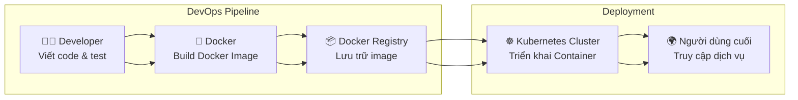

omen@omen-MS-7918:/opt/fr03$ cat /etc/resolv.conf
# This is /run/systemd/resolve/stub-resolv.conf managed by man:systemd-resolved(8).
# Do not edit.
#
# This file might be symlinked as /etc/resolv.conf. If you're looking at
# /etc/resolv.conf and seeing this text, you have followed the symlink.
#
# This is a dynamic resolv.conf file for connecting local clients to the
# internal DNS stub resolver of systemd-resolved. This file lists all
# configured search domains.
#
# Run "resolvectl status" to see details about the uplink DNS servers
# currently in use.
#
# Third party programs should typically not access this file directly, but only
# through the symlink at /etc/resolv.conf. To manage man:resolv.conf(5) in a
# different way, replace this symlink by a static file or a different symlink.
#
# See man:systemd-resolved.service(8) for details about the supported modes of
# operation for /etc/resolv.conf.

nameserver 127.0.0.53
options edns0 trust-ad
search tail3d127.ts.net
omen@omen-MS-7918:/opt/fr03$ sudo nano /etc/resolv.conf
[sudo] password for omen:
omen@omen-MS-7918:/opt/fr03$ sudo nano /etc/systemd/resolved.conf
omen@omen-MS-7918:/opt/fr03$ sudo systemctl restart systemd-resolved
omen@omen-MS-7918:/opt/fr03$ ping google.com
omen@omen-MS-7918:/opt/fr03$ cat /etc/os-release
NAME="Linux Mint"
VERSION="22.3 (Zena)"
ID=linuxmint
ID_LIKE="ubuntu debian"
PRETTY_NAME="Linux Mint 22.3"
VERSION_ID="22.3"
HOME_URL="https://www.linuxmint.com/"
SUPPORT_URL="https://forums.linuxmint.com/"
BUG_REPORT_URL="http://linuxmint-troubleshooting-guide.readthedocs.io/en/latest/"
PRIVACY_POLICY_URL="https://www.linuxmint.com/"
VERSION_CODENAME=zena
UBUNTU_CODENAME=noble
omen@omen-MS-7918:/opt/fr03$ sudo rm /etc/apt/sources.list.d/docker.list

À, té ra bạn đang dùng **Linux Mint 22.3 (Zena)**! Linux Mint 22 dựa trên nền tảng **Ubuntu 24.04 (Noble)**, nhưng vì biến `$VERSION_CODENAME` của bạn trả về `zena` thay vì `noble`, nên máy chủ Docker không tìm thấy gói phần mềm phù hợp.

Dưới đây là chuỗi lệnh chuẩn xác nhất để "ép" hệ thống lấy đúng gói Docker dành cho nền tảng Ubuntu mà Mint đang đứng trên đó:

---

### 1. Làm sạch cấu hình cũ

Để tránh xung đột, hãy xóa file lỗi trước:

```bash
sudo rm /etc/apt/sources.list.d/docker.list

```

### 2. Thiết lập Repository chuẩn (Dùng Noble)

Thay vì dùng biến tự động, chúng ta sẽ chỉ định thẳng tên mã `noble`:

```bash
echo \
  "deb [arch=$(dpkg --print-architecture) signed-by=/etc/apt/keyrings/docker.gpg] https://download.docker.com/linux/ubuntu \
  noble stable" | sudo tee /etc/apt/sources.list.d/docker.list > /dev/null

```

### 3. Cập nhật và Cài đặt

Bây giờ lệnh `update` sẽ tìm thấy các gói Docker:

```bash
sudo apt-get update
sudo apt-get install docker-ce docker-ce-cli containerd.io docker-compose-plugin

```

---

### 4. Cấu hình để dùng Docker không cần `sudo`

Trên Linux Mint, việc này giúp bạn thao tác tiện lợi hơn nhiều:

```bash
# Tạo group docker (thường đã có sẵn)
sudo groupadd docker

# Thêm user hiện tại của bạn vào group
sudo usermod -aG docker $USER

```

> **Lưu ý:** Sau lệnh này, bạn cần **Khởi động lại máy** (hoặc Log out rồi Log in) để lệnh `docker` có hiệu lực mà không cần gõ `sudo`.

---

### 5. Kiểm tra kết quả

Hãy chạy thử lệnh này để chắc chắn mọi thứ đã ổn:

```bash
docker --version
sudo docker run hello-world

```

**Một chút kinh nghiệm với Linux Mint:** Vì bạn đang có sẵn Driver NVIDIA (tôi thấy repo CUDA trong log trước của bạn), nếu bạn định dùng Docker để chạy các tác vụ liên quan đến AI hoặc đồ họa, bạn sẽ cần cài thêm **NVIDIA Container Toolkit**.

Bạn đã cài xong bước trên chưa? Nếu rồi, tôi sẽ gửi tiếp lệnh cài Toolkit để Docker "ăn" được card đồ họa của bạn!
Tuyệt vời, vì bạn đang dùng **Linux Mint 22 (nền Ubuntu 24.04 Noble)** và đã có sẵn Driver NVIDIA, việc cài đặt **NVIDIA Container Toolkit** sẽ giúp các container Docker "nhìn thấy" và sử dụng được sức mạnh của GPU (rất quan trọng cho AI, Stable Diffusion, hoặc Render).

Hãy thực hiện theo các bước sau:

---

### 1. Thêm Repository của NVIDIA

Bạn cần thêm kho lưu trữ chính thức của NVIDIA vào hệ thống:

```bash
curl -fsSL https://nvidia.github.io/libnvidia-container/gpgkey | sudo gpg --dearmor -o /usr/share/keyrings/nvidia-container-toolkit-keyring.gpg \
  && curl -s -L https://nvidia.github.io/libnvidia-container/stable/deb/nvidia-container-toolkit.list | \
    sed 's#deb https://#deb [signed-by=/usr/share/keyrings/nvidia-container-toolkit-keyring.gpg] https://#g' | \
    sudo tee /etc/apt/sources.list.d/nvidia-container-toolkit.list

```

### 2. Cài đặt Toolkit

Cập nhật lại danh sách gói và tiến hành cài đặt:

```bash
sudo apt-get update
sudo apt-get install -y nvidia-container-toolkit

```

### 3. Cấu hình Docker để nhận diện GPU

Lệnh này sẽ tự động sửa file cấu hình của Docker (`daemon.json`) để nó biết cách sử dụng driver NVIDIA:

```bash
sudo nvidia-ctk runtime configure --launcher=docker

```

### 4. Khởi động lại Docker

Để các thay đổi có hiệu lực, bạn phải khởi động lại dịch vụ Docker:

```bash
sudo systemctl restart docker

```

---

### 5. Kiểm tra xem Docker đã "thấy" Card đồ họa chưa

Đây là bước quan trọng nhất. Hãy chạy thử một container nhỏ của NVIDIA để kiểm tra thông số GPU:

```bash
sudo docker run --rm --gpus all nvidia/cuda:12.0.1-base-ubuntu22.04 nvidia-smi

```

* **Nếu thành công:** Bạn sẽ thấy bảng thông số kỹ thuật của card đồ họa (tên card, lượng VRAM đang dùng...) hiện ra trong terminal giống hệt như khi bạn gõ `nvidia-smi` ở máy thật.
* **Nếu lỗi:** Có thể do phiên bản CUDA của container không tương thích với Driver máy thật, lúc đó hãy báo tôi để điều chỉnh tag image.

---

### Một vài lưu ý nhỏ:

* **Lệnh chạy sau này:** Khi muốn một container sử dụng GPU, bạn luôn phải thêm flag `--gpus all` vào lệnh `docker run`.
* **Với Docker Compose:** Bạn sẽ cần thêm cấu hình `deploy: resources: reservations: devices:` vào file `.yml`.

Bạn có dự định chạy ứng dụng cụ thể nào trên Docker (ví dụ: Ollama, Stable Diffusion, hay Web server) không? Tôi có thể giúp bạn soạn file `docker-compose.yml` mẫu!

Lỗi này xảy ra vì phiên bản `nvidia-ctk` mới nhất đã thay đổi cấu trúc lệnh một chút (bỏ dấu gạch ngang ở `launcher` hoặc đổi thành tham số mặc định).

Bạn hãy thử lại với lệnh chuẩn dưới đây, nó sẽ tự động nhận diện runtime cho Docker:

```bash
sudo nvidia-ctk runtime configure --runtime=docker

```

Hoặc đơn giản hơn (vì Docker thường là mặc định):

```bash
sudo nvidia-ctk runtime configure

```

### Sau đó, bạn đừng quên khởi động lại Docker:

```bash
sudo systemctl restart docker

```

---

### Cách kiểm tra "chốt hạ"

Sau khi khởi động lại, bạn hãy chạy lệnh này để xác nhận Docker đã thực sự hỗ trợ GPU:

```bash
docker info | grep -i nvidia

```

Nếu kết quả hiện ra có dòng `Runtimes: ... nvidia ...` là bạn đã cấu hình thành công!

---

### Bước cuối cùng: Test thực tế

Hãy thử chạy lệnh "thần thánh" này để xem Docker có gọi được GPU không:

```bash
sudo docker run --rm --gpus all nvidia/cuda:12.0.1-base-ubuntu22.04 nvidia-smi

```

Nếu bảng thông số GPU hiện lên, thì xin chúc mừng, hệ thống của bạn đã sẵn sàng cho mọi tác vụ AI nặng nhất rồi đó!

Bạn định cài **Ollama** hay **Stable Diffusion** lên Docker này không? Tôi có thể hỗ trợ bạn viết file cấu hình để chạy chúng chỉ bằng một lệnh duy nhất.


PS C:\\Users\\Admin> docker volume create portainer_data
portainer_data
PS C:\\Users\\Admin> docker run -d -p 8009:8000 -p 9443:9443 --name portainer --restart=always -v /var/run/docker.sock:/var/run/docker.sock -v portainer_data:/data portainer/portainer-ce:lts

Ubuntu

```bash
sudo docker volume create portainer_data
```

Unable to find image 'portainer/portainer-ce:lts' locally
lts: Pulling from portainer/portainer-ce
4f4fb700ef54: Pull complete
e09df2601140: Pull complete
026c6c48a0ca: Pull complete
39c064200eba: Pull complete
e4ba18366a7f: Pull complete
978ce5e921d5: Pull complete
04de093ad5ed: Pull complete
63c930229559: Pull complete
d3b1c06ebf8c: Pull complete
a9ff7abff372: Pull complete
Digest: sha256:224a378fbc5ae579dc9d570c5ca2e5e981a4a003c8d7c2c5b5e482af97c2f87c
Status: Downloaded newer image for portainer/portainer-ce:lts
eac3c6490db89356e62948e9a1b3b9b42d9d777f87600522a6468bbb93c81617

```bash
 PS C:\Users\Admin> docker run -d -p 8009:8000 -p 9443:9443 -p 9000:9000 --name portainer --restart=always -v /var/run/docker.sock:/var/run/docker.sock -v portainer_data:/data portainer/portainer-ce:lts
3469e6c7a9b80818c341ed5a6bcfbb2f6520bc49f36c5205e7d3ed6e8af095b2
PS C:\Users\Admin> docker run -d -p 9443:9443 -p 9006:9000 --name portainer --restart=always -v /var/run/docker.sock:/var/run/docker.sock -v portainer_data:/data portainer/portainer-ce:lts
0494dbb1a001799920ee826cc126bd4eb4635e15030366a3c8ac6098b5debb4e
PS C:\Users\Admin>
```

Lệnh này chạy đúng

```bash
sudo docker run -d -p 9443:9443 -p 9006:9000 --name portainer --restart=always -v /var/run/docker.sock:/var/run/docker.sock -v portainer_data:/data portainer/portainer-ce:lts
```
https://192.168.22.167:9443/#!/3/docker/containers
docker run -d -p 9443:9443 -p 9006:9000 --name portainer --restart=always -v /var/run/docker.sock:/var/run/docker.sock -v portainer_data:/data portainer/portainer-ce:lts
Chuẩn rồi Tuấn 🚀, Docker Desktop trên Windows hay gặp tình trạng chiếm nhiều dung lượng vì:

* Image cũ không dùng nữa.
* Container stopped nhưng chưa xóa.
* Volume & network tạo ra rồi để quên.
* Build cache (layer) còn lưu.

Mình hướng dẫn cách dọn sạch nhé:

---

## 1. Xem dung lượng đang chiếm

```powershell
docker system df
```

👉 Sẽ thấy image, container, volume đang ngốn bao nhiêu GB.

---

## 2. Xóa container không chạy

```powershell
docker container prune
```

👉 Xóa tất cả container đã **stopped**.

---

## 3. Xóa image không dùng

```powershell
docker image prune -a
```

👉 `-a` để xóa **tất cả image không còn được container nào dùng**.

---

## 4. Xóa volume không dùng

```powershell
docker volume prune
```

👉 Volume thường chiếm nhiều dung lượng (VD database cũ).

---

## 5. Xóa network cũ

```powershell
docker network prune
```

---

## 6. Xóa tất cả mọi thứ rác một lần

```powershell
docker system prune -a --volumes
```

👉 Cẩn thận: xóa hết container, image, volume, network không dùng.

---

## 7. Clean thêm với Docker Desktop GUI

* Mở Docker Desktop → **Settings → Resources → Advanced → Clean / Purge Data**.
* Hoặc dùng tab **Images/Volumes** để chọn và xóa thủ công.

---

## 8. Tránh tái diễn

* Dùng `docker image prune` định kỳ.
* Dùng `.dockerignore` khi build để không đưa file nặng (vd: dataset, log).
* Nếu build nhiều image test → nên đặt tag để dễ quản lý/xóa.

---

👉 Tuấn có muốn mình viết cho một đoạn **PowerShell script tự động dọn dẹp Docker** (chạy một phát là clean toàn bộ rác) để lần sau chỉ cần double-click là dọn không?

---
À chuẩn rồi Tuấn 👌, phần **Build Cache** chính là nguyên nhân chiếm bộ nhớ lớn (11GB ở máy Tuấn). Đây là các layer trung gian Docker tạo ra mỗi lần build image.

---

## 1. Xem build cache chi tiết

```powershell
docker builder prune --verbose
```

👉 Cho thấy layer nào chiếm dung lượng.

---

## 2. Xóa toàn bộ build cache

```powershell
docker builder prune
```

* Mặc định: chỉ xóa cache không dùng.
* Thêm `-a` để xóa **tất cả cache**:

```powershell
docker builder prune -a
```

👉 Sau lệnh này, build lần sau sẽ lâu hơn vì Docker phải build lại từ đầu (không tận dụng cache).

---

## 3. Dọn tất cả một phát (bao gồm cache, volume, image rác)

```powershell
docker system prune -a --volumes
docker builder prune -a
```

---

## 4. Cách **tránh build cache phình to** trong tương lai

* Khi build image, dùng `.dockerignore` để tránh copy những file nặng (dataset, log, venv…).
* Dùng **multi-stage build** để image gọn và ít cache hơn.
* Nếu build thử nghiệm nhiều, nên cleanup định kỳ (VD: hàng tuần).

---

👉 Với tình huống máy Tuấn đang có \~11GB cache, chỉ cần:

```powershell
docker builder prune -a
```

là sẽ giải phóng được gần như toàn bộ.

---

Tuấn có muốn mình viết luôn cho một **script PowerShell tự động dọn rác Docker (image, container, volume, build cache)** để mỗi lần chỉ cần chạy 1 file `.ps1` là sạch toàn bộ không?

---
Chuẩn rồi Tuấn 👍 nếu Tuấn đã quen Docker thì học Kubernetes sẽ dễ hơn nhiều, coi như lên “level orchestration”. Mình sẽ giúp Tuấn làm quen từng bước.

---

## 1. Hiểu cách dùng Kubernetes (K8s)

Kubernetes không thay thế Docker, nó **dùng Docker image để triển khai**, nhưng quản lý ở mức cao hơn:

* **Pod**: đơn vị nhỏ nhất trong K8s, thường chạy 1 hoặc nhiều container.
* **Deployment**: định nghĩa cách chạy Pod (bao nhiêu replica, rolling update).
* **Service**: để các Pod giao tiếp với nhau và với bên ngoài (ClusterIP, NodePort, LoadBalancer).
* **ConfigMap & Secret**: truyền config cho container.
* **Ingress**: cho phép user truy cập qua domain/URL.

👉 Nói gọn: Docker = chạy container; Kubernetes = quản lý cả đội container.

---

## 2. Cách cài nhanh để làm quen

Nếu Tuấn muốn thử ngay trên máy đã có Docker thì dễ nhất:

### Cách 1: Dùng **Minikube**

```bash
# cài minikube
choco install minikube -y   # nếu dùng Windows + Chocolatey
# hoặc Linux
curl -LO https://storage.googleapis.com/minikube/releases/latest/minikube-linux-amd64
sudo install minikube-linux-amd64 /usr/local/bin/minikube

# khởi động cluster Kubernetes local
minikube start

# kiểm tra
kubectl get nodes
```

### Cách 2: Dùng **Docker Desktop (có Kubernetes tích hợp)**

* Nếu Tuấn đang dùng Docker Desktop thì chỉ cần vào **Settings → Kubernetes → Enable Kubernetes** → Docker Desktop sẽ tự dựng cluster K8s local.

---

## 3. Bắt đầu với ví dụ Hello World

Tạo file `nginx-deployment.yaml`:

```yaml
apiVersion: apps/v1
kind: Deployment
metadata:
  name: nginx-deployment
spec:
  replicas: 2
  selector:
    matchLabels:
      app: nginx
  template:
    metadata:
      labels:
        app: nginx
    spec:
      containers:
      - name: nginx
        image: nginx:latest
        ports:
        - containerPort: 80
---
apiVersion: v1
kind: Service
metadata:
  name: nginx-service
spec:
  type: NodePort
  selector:
    app: nginx
  ports:
    - port: 80
      targetPort: 80
      nodePort: 30080
```

Chạy lệnh:

```bash
kubectl apply -f nginx-deployment.yaml
kubectl get pods
kubectl get svc
```

👉 Truy cập `http://localhost:30080` → sẽ thấy trang **Welcome to nginx!**

---

## 4. Các lệnh cơ bản để làm quen

```bash
kubectl get pods            # liệt kê pod
kubectl get svc             # liệt kê service
kubectl describe pod <ten>  # xem chi tiết pod
kubectl logs <ten-pod>      # xem log container
kubectl delete -f nginx-deployment.yaml  # xoá deployment & service
```

---

## 5. Mục tiêu học

* Bước 1: Chạy thử Pod/Deployment với image có sẵn (nginx, redis, postgres).
* Bước 2: Đóng gói app Python/Flask của Tuấn bằng Docker → chạy trên K8s.
* Bước 3: Học Ingress, ConfigMap, Secret để hoàn thiện pipeline.

---

👉 Tuấn muốn mình chuẩn bị sẵn một **lộ trình học Kubernetes trong 7 ngày** (theo kiểu từ cơ bản đến chạy app thật) hay muốn mình dẫn từng bước “học đến đâu thử ngay đến đó”?

---
Ok, Tuấn 👍 mình sẽ vẽ sơ đồ **Mermaid pipeline** cho dòng triển khai từ Developer → Docker → Kubernetes → Người dùng cuối.



👉 Ý nghĩa:

* **Developer**: viết code, commit.
* **Docker**: đóng gói code thành image.
* **Registry**: nơi lưu giữ image (Docker Hub, GitHub Container Registry, Harbor...).
* **Kubernetes**: lấy image, tạo container, scale, load balance.
* **Người dùng cuối**: truy cập ứng dụng qua web/app/API.

---

Tuấn có muốn mình mở rộng thêm **các bước CI/CD tự động** (ví dụ GitHub Actions/Jenkins build → push Docker image → deploy lên K8s) để thấy luồng tự động hoá đầy đủ hơn không?

---
Câu hỏi rất chuẩn 👌 Tuấn đang lo “đầu tư công sức build với Docker + K8s OSS, sau này chuyển sang cloud/managed service có phải viết lại code không?” → Đây là kinh nghiệm thực chiến mình chia sẻ:

---

## 1. Về **Docker**

* Docker image tuân theo chuẩn **OCI (Open Container Initiative)**.
* Miễn là ứng dụng của Tuấn đóng gói thành container → chạy ở đâu cũng được (laptop, server công ty, cloud GCP/AWS/Azure).
  👉 **Không cần code lại.**

---

## 2. Về **Kubernetes**

* Kubernetes có một chuẩn API thống nhất (Deployment, Service, Ingress, ConfigMap, Secret...).
* Dù Tuấn chạy trên:

  * **Kubernetes OSS tự dựng** (kubeadm, k3s, microk8s...),
  * hay **Managed Kubernetes** (GKE, EKS, AKS),
    thì **YAML manifest gần như không đổi**.
    👉 Ví dụ `deployment.yaml` và `service.yaml` của Tuấn vẫn apply được 99%.

---

## 3. Những chỗ **có thể phải điều chỉnh**

Không phải code lại app, chỉ chỉnh hạ tầng:

* **Storage (Persistent Volume):**

  * On-prem dùng NFS, Ceph, local disk.
  * Cloud dùng EBS (AWS), PersistentDisk (GCP), AzureDisk.
    → Chỉ cần đổi `StorageClass`, app không phải viết lại.
* **Ingress/LoadBalancer:**

  * On-prem thường dùng ingress-nginx + MetalLB.
  * Cloud có sẵn load balancer (ELB, GLB...).
    → Chỉ đổi cấu hình network, app không đổi.
* **Secrets & Config:**

  * Kubernetes hỗ trợ chung, nhưng cloud có thể tích hợp thêm dịch vụ riêng (AWS Secret Manager, GCP Secret Manager...).
    → Nếu muốn tận dụng dịch vụ riêng thì có thêm bước cấu hình, nhưng không bắt buộc.
* **Monitoring/Logging:**

  * On-prem tự dựng (Prometheus, ELK).
  * Cloud có sẵn (CloudWatch, Stackdriver).
    → App không đổi, chỉ thay cách thu log/metric.

---

## 4. Kết luận

* 🚀 Tuấn hoàn toàn có thể **bắt đầu với Docker + Kubernetes OSS miễn phí**.
* Sau này nếu chuyển lên **cloud managed Kubernetes** → **không phải code lại app**.
* Chỉ cần điều chỉnh **YAML hạ tầng** (Storage, Ingress, Monitoring).
* Đây cũng chính là sức mạnh của container + K8s: **portability (tính di động)**.

---

Anh có muốn tôi vẽ cho một **so sánh bảng song song On-prem K8s vs Cloud K8s** (về Storage, Network, Monitoring, Chi phí) để dễ hình dung khi quyết định triển khai không?

---
Câu hỏi hay 👍

Về **chi phí khi triển khai thương mại với Docker + Kubernetes**, chia làm 2 phần:

---

## 1. Docker

* **Docker Engine / Docker CLI** (cái để build và chạy container):
  ✅ Miễn phí, open-source (Apache License).
* **Docker Desktop** (chạy trên Windows/Mac):

  * Miễn phí cho cá nhân, startup nhỏ (dưới 250 nhân viên hoặc < \$10M doanh thu).
  * Nếu công ty lớn hơn mức đó → cần mua license (Docker Business).
* **Docker Hub** (nơi lưu trữ container image):

  * Có **gói miễn phí** nhưng giới hạn pull (tải về image) mỗi tháng.
  * Muốn private repository nhiều, hoặc tải không giới hạn → phải trả tiền.

---

## 2. Kubernetes

* **Kubernetes bản gốc (OSS)**:
  ✅ Miễn phí hoàn toàn, có thể tự triển khai trên server hoặc cloud riêng.
* **Chi phí thực tế** phát sinh khi chạy Kubernetes ở môi trường thật:

  * **Hạ tầng** (cloud server, VM, bare metal) → phải trả tiền cho máy chủ hoặc cloud.
  * **Dịch vụ quản lý Kubernetes (Managed Kubernetes)**:

    * GKE (Google Kubernetes Engine),
    * EKS (Amazon Elastic Kubernetes Service),
    * AKS (Azure Kubernetes Service).
      → Phần **dịch vụ quản lý** có thể tính phí (nhưng thường thấp, \~0.1 USD/giờ cho cluster).
      → Phần **máy chủ chạy container** vẫn phải trả riêng.

---

## 3. Kết luận thực tế

* Nếu **deploy thương mại tự quản lý trên server riêng** → Docker + Kubernetes bản gốc **miễn phí** → chỉ tốn tiền mua server/vps.
* Nếu **dùng cloud provider để dễ quản lý, scale nhanh** → phải trả thêm phí cho cloud (VM + dịch vụ K8s).
* Docker Hub private repo nhiều → mất phí.
* Docker Desktop cho công ty lớn → mất phí license.

---

👉 Nói ngắn gọn:

* **Docker/K8s core = miễn phí.**
* **Mất tiền** ở: hạ tầng, dịch vụ cloud, Docker Desktop (doanh nghiệp lớn), Docker Hub (gói cao cấp).

---

Anh muốn tôi phân tích chi tiết luôn xem **trường hợp nào nên tự build (on-prem)** và **trường hợp nào nên thuê cloud (managed Kubernetes)** cho một hệ thống như “Face AI Canh Giác Gia Đình” không?
---
Có 2 cách chính để bạn làm việc này, tuỳ mục đích phát triển (development) hay chạy thật (production):

---

## 🔹 1. Dành cho **development** (muốn sửa code và thấy thay đổi ngay trong container)

Bạn không cần rebuild image mỗi lần sửa code. Thay vào đó:

* Mount code từ host vào container bằng `volumes` trong `docker-compose.yml` hoặc lệnh `docker run -v`.

Ví dụ:

```yaml
version: "3.9"
services:
  app:
    build: .
    volumes:
      - ./src:/app   # mount thư mục code host vào container
    ports:
      - "8000:8000"
    command: python -m uvicorn main:app --host 0.0.0.0 --port 8000 --reload
```

* Ở đây `--reload` (nếu bạn dùng **uvicorn/FastAPI/Flask debug mode**) sẽ tự động load lại code khi có thay đổi.

👉 Ưu điểm: sửa code bên ngoài là thấy kết quả ngay.
👉 Nhược điểm: không tối ưu cho production.

---

## 🔹 2. Dành cho **production** (chạy ổn định, không hot-reload)

Mỗi khi sửa source code Python bạn cần:

1. Rebuild lại Docker image:

   ```bash
   docker compose build app
   ```

   hoặc

   ```bash
   docker build -t myapp .
   ```

2. Restart container để chạy code mới:

   ```bash
   docker compose up -d
   ```

   hoặc

   ```bash
   docker run -d -p 8000:8000 myapp
   ```

👉 Cách này đảm bảo môi trường luôn đồng nhất và tránh lỗi do mount.

---

📌 Tóm lại:

* **Phát triển (dev)** → mount code (`volumes`) + bật hot reload.
* **Triển khai (prod)** → rebuild image + restart container.

---

Bạn đang muốn môi trường của mình chạy theo hướng **dev (sửa code là thấy ngay)** hay **prod (mỗi lần cập nhật thì build lại image)**?


